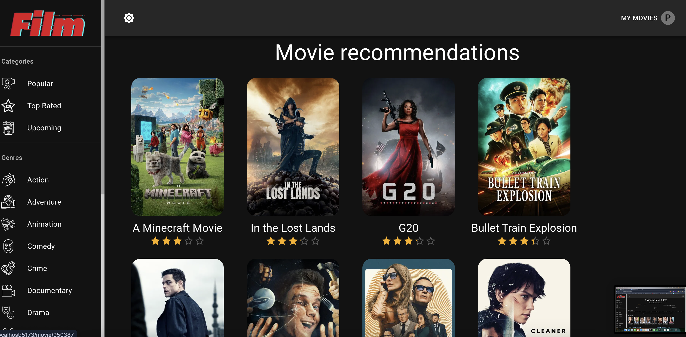

# Movie App

Film, a movie app built with **React** + **Vite**, state managed using **Redux** and axios for fetching data from TMDB API endpoints.

## Motive

A challenge inspired by Adrian of JSM (such a great tutor) from the first render to an absolute app ready fro production. Though not a big fan of movies but this now can serve as a pseudo movie playlist.

## Tech Stack


## Features

- User authentication with secure login through TMDB
- Real-time movie genres & categories
- Trailers, top cast and a movie recommendation section
- Responsive design for all devices and accessible
- Light/Dark theme

## Setup Steps

### Setup Environment Variables (.env.example)

```
VITE_TMDB_KEY=
TMDB_TOKEN=
VITE_ESLINT_NO_DEV_ERRORS=
```

1. Open repo on IDE
2. Install dependencies using `npm install`
3. Start the development server with `npm run dev`.

## Status

All current features funtional, app is 100% production ready!

### Todo

- [ ] Integrate Alan AI
- [ ] Test
- [ ] Hosting



